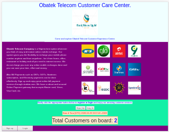

# README

BUSINESS COMMUNICATION APPLICATION.

## Capstone Project Title: Obatek-Comm-App

This project was created using Ruby, Ruby on Rails, HTML5, CSS3 and BOOTSTRAP.This is a customer relation app to service customers' requests and resolve their complains.

## Built With
- Ruby,
- Ruby on Raiils
- HTML5,
- CSS3,
- rubocop,
- linters,
- Bootstrap.

## Live Demo

[Live Demo Link]()

## Author

👤 Adesoji Adewumi

- Github: [@AdesojiCodeMaster](https://github.com/AdesojiCodeMaster)
- Twitter: [@codemas22665735](https://twitter.com/codemas22665735)
- Linkedin: [linkedin](https://www.linkedin.com/in/adesoji-adewumi)

## 🤝 Contributing

Contributions, issues and feature requests are welcome!

## Show your support

Give a ⭐️ if you like this project!

## Acknowledgments

- Microverse
- GitHub
- TheOdinProject

## 📝 License MIT

This project is an open licensed.
